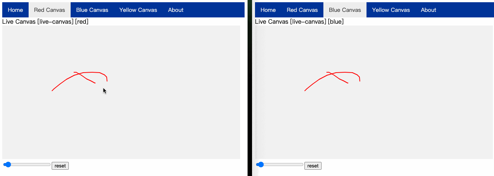

# @imnull/broadcast [](https://www.npmjs.com/package/@imnull/broadcast)


基于`BroadcastChannel`的本地跨`tab`通信工具。

```tsx
import { createChanel } from "@imnull/broadcast";

const client = createChanel('channl01');
// 监听数据
client.ondata = (event) => {
    const data = event.detail;
    console.log('recieve data:', data)
    // some code about `data`
};
// 发送数据
client.sendData({ command: 'reset' })
client.close()
```
具体技术细节可参考`BroadcastChannel`相关文档，内部的`TypedBroadcastChannel`仅对交互数据做了强类型封装。

# Demo

